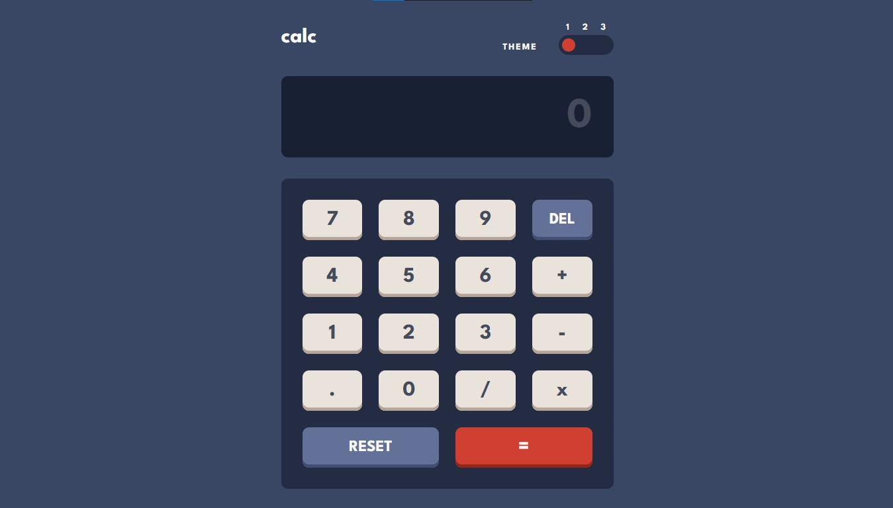

# 🔢 Calculator app

This is a solution to the [Calculator app challenge on Frontend Mentor](https://www.frontendmentor.io/challenges/calculator-app-9lteq5N29). Frontend Mentor challenges help you improve your coding skills by building realistic projects.

### 📌 Links

- Solution URL: [GitHub](https://github.com/NahuelEF/calculator-app.git)
- Live Site URL: [GitHub Pages](https://nahuelef.github.io/calculator-app/)

## 🎯 The challenge

Users should be able to:

- [x] See the size of the elements adjust based on their device's screen size
- [x] Perform mathmatical operations like addition, subtraction, multiplication, and division
- [x] Adjust the color theme based on their preference
- [x] **Bonus**: Have their initial theme preference checked using `prefers-color-scheme` and have any additional changes saved in the browser

## 🛠 Built with

- Semantic HTML5 markup
- CSS custom properties
- Flexbox
- CSS Grid
- [Sass/Scss](https://sass-lang.com/)

## 👨‍💻 Author

- Frontend Mentor - [@NahuelEF](https://www.frontendmentor.io/profile/NahuelEF)
